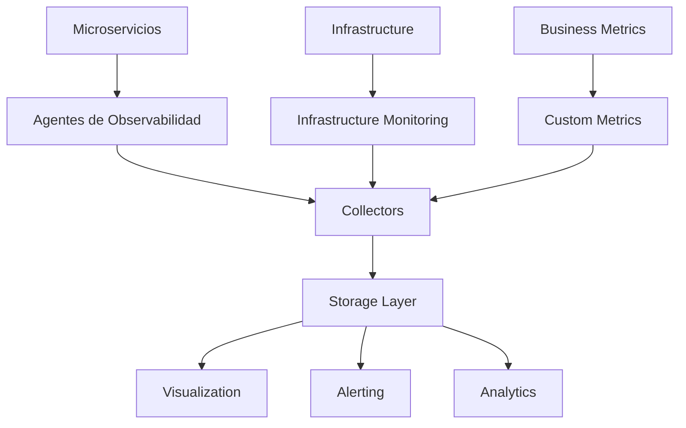

# Observabilidad y Monitorización

## Propósito

La observabilidad es la capacidad de entender el estado interno de un sistema basándose en sus salidas externas. En arquitecturas modernas, especialmente microservicios, la observabilidad es crítica para detectar problemas, optimizar rendimiento y mantener la confiabilidad del sistema.

## Los Tres Pilares de la Observabilidad

### 1. Métricas (Metrics)
Métricas cuantitativas que miden el comportamiento del sistema en el tiempo.

### 2. Logs
Registros de eventos que ocurren en el sistema, incluyendo información contextual.

### 3. Trazas (Traces)
Información sobre el flujo de una solicitud a través de múltiples servicios.

## Estrategia de Observabilidad

### Arquitectura de Observabilidad



### Stack Tecnológico de Observabilidad

#### AWS Native Stack
```yaml
# CloudWatch Configuration
CloudWatch:
  Metrics:
    - CPU Utilization
    - Memory Usage
    - Network I/O
    - Disk I/O
    - Application Metrics
  Logs:
    - Application Logs
    - Access Logs
    - Error Logs
    - Security Logs
  Alarms:
    - High CPU Usage
    - High Memory Usage
    - Error Rate Threshold
    - Response Time Threshold
```

#### Open Source Stack
```yaml
# Prometheus + Grafana + ELK Stack
Prometheus:
  - Service Discovery
  - Metrics Collection
  - Alerting Rules

Grafana:
  - Dashboards
  - Alerting
  - Visualization

ELK Stack:
  Elasticsearch:
    - Log Storage
    - Search Engine
  Logstash:
    - Log Processing
    - Data Transformation
  Kibana:
    - Log Visualization
    - Dashboard Creation
```

## Implementación en .NET 8

### Métricas con Prometheus
```csharp
// Program.cs
using Prometheus;

var builder = WebApplication.CreateBuilder(args);

// Configurar métricas de Prometheus
builder.Services.AddMetrics();

var app = builder.Build();

// Exponer endpoint de métricas
app.UseMetricServer();
app.UseHttpMetrics();

// Configurar métricas personalizadas
var requestCounter = Metrics.CreateCounter("http_requests_total", "Total HTTP requests", new CounterConfiguration
{
    LabelNames = new[] { "method", "endpoint", "status" }
});

var requestDuration = Metrics.CreateHistogram("http_request_duration_seconds", "HTTP request duration", new HistogramConfiguration
{
    LabelNames = new[] { "method", "endpoint" }
});

app.MapGet("/metrics", () => Metrics.DefaultRegistry.CollectAndExportAsTextAsync());
```

### Logging Estructurado con Serilog
```csharp
// Program.cs
using Serilog;
using Serilog.Events;

Log.Logger = new LoggerConfiguration()
    .MinimumLevel.Information()
    .MinimumLevel.Override("Microsoft", LogEventLevel.Warning)
    .Enrich.FromLogContext()
    .Enrich.WithMachineName()
    .Enrich.WithEnvironmentName()
    .WriteTo.Console(new JsonFormatter())
    .WriteTo.AmazonCloudWatch(
        logGroup: "/aws/ecs/myapp",
        region: "us-east-1",
        logStreamNameProvider: new DefaultLogStreamProvider(),
        textFormatter: new JsonFormatter()
    )
    .WriteTo.Elasticsearch(new ElasticsearchSinkOptions(new Uri("http://elasticsearch:9200"))
    {
        AutoRegisterTemplate = true,
        AutoRegisterTemplateVersion = AutoRegisterTemplateVersion.ESv7,
        IndexFormat = $"myapp-{DateTime.UtcNow:yyyy.MM}"
    })
    .CreateLogger();

builder.Host.UseSerilog();
```

### Distributed Tracing con OpenTelemetry
```csharp
// Program.cs
using OpenTelemetry;
using OpenTelemetry.Trace;
using OpenTelemetry.Metrics;
using OpenTelemetry.Logs;

var builder = WebApplication.CreateBuilder(args);

// Configurar OpenTelemetry
builder.Services.AddOpenTelemetry()
    .WithTracing(tracing => tracing
        .AddAspNetCoreInstrumentation()
        .AddHttpClientInstrumentation()
        .AddEntityFrameworkCoreInstrumentation()
        .AddRedisInstrumentation()
        .AddOtlpExporter(opts => opts.Endpoint = new Uri("http://jaeger:4317")))
    .WithMetrics(metrics => metrics
        .AddAspNetCoreInstrumentation()
        .AddHttpClientInstrumentation()
        .AddRuntimeInstrumentation()
        .AddOtlpExporter(opts => opts.Endpoint = new Uri("http://prometheus:4317")))
    .WithLogging(logging => logging
        .AddOpenTelemetry(opts => opts
            .AddOtlpExporter(opts => opts.Endpoint = new Uri("http://elasticsearch:4317"))));

var app = builder.Build();
```

### Health Checks Avanzados
```csharp
// HealthChecks/DatabaseHealthCheck.cs
public class DatabaseHealthCheck : IHealthCheck
{
    private readonly IDbConnection _dbConnection;
    private readonly ILogger<DatabaseHealthCheck> _logger;

    public DatabaseHealthCheck(IDbConnection dbConnection, ILogger<DatabaseHealthCheck> logger)
    {
        _dbConnection = dbConnection;
        _logger = logger;
    }

    public async Task<HealthCheckResult> CheckHealthAsync(HealthCheckContext context, CancellationToken cancellationToken = default)
    {
        try
        {
            using var connection = _dbConnection;
            await connection.OpenAsync(cancellationToken);

            using var command = connection.CreateCommand();
            command.CommandText = "SELECT 1";
            command.CommandTimeout = 5;

            var result = await command.ExecuteScalarAsync(cancellationToken);

            if (result != null)
            {
                return HealthCheckResult.Healthy("Database is responding");
            }

            return HealthCheckResult.Unhealthy("Database query failed");
        }
        catch (Exception ex)
        {
            _logger.LogError(ex, "Database health check failed");
            return HealthCheckResult.Unhealthy("Database connection failed", ex);
        }
    }
}

// Program.cs
builder.Services.AddHealthChecks()
    .AddCheck<DatabaseHealthCheck>("database", tags: new[] { "database" })
    .AddCheck<RedisHealthCheck>("redis", tags: new[] { "cache" })
    .AddCheck<ExternalServiceHealthCheck>("external-service", tags: new[] { "external" })
    .AddCheck<DiskSpaceHealthCheck>("disk-space", tags: new[] { "infrastructure" });

app.MapHealthChecks("/health", new HealthCheckOptions
{
    ResponseWriter = UIResponseWriter.WriteHealthCheckUIResponse,
    ResultStatusCodes =
    {
        [HealthStatus.Healthy] = StatusCodes.Status200OK,
        [HealthStatus.Degraded] = StatusCodes.Status200OK,
        [HealthStatus.Unhealthy] = StatusCodes.Status503ServiceUnavailable
    },
    Predicate = check => check.Tags.Contains("database") || check.Tags.Contains("cache")
});
```

## Métricas de Negocio

### Custom Metrics
```csharp
// Services/MetricsService.cs
public class MetricsService
{
    private readonly Counter _ordersProcessed;
    private readonly Counter _ordersFailed;
    private readonly Histogram _orderProcessingTime;
    private readonly Gauge _activeUsers;
    private readonly Counter _revenueGenerated;

    public MetricsService()
    {
        _ordersProcessed = Metrics.CreateCounter("orders_processed_total", "Total orders processed");
        _ordersFailed = Metrics.CreateCounter("orders_failed_total", "Total orders failed");
        _orderProcessingTime = Metrics.CreateHistogram("order_processing_duration_seconds", "Order processing time");
        _activeUsers = Metrics.CreateGauge("active_users", "Number of active users");
        _revenueGenerated = Metrics.CreateCounter("revenue_generated_total", "Total revenue generated", new CounterConfiguration
        {
            LabelNames = new[] { "currency" }
        });
    }

    public void RecordOrderProcessed()
    {
        _ordersProcessed.Inc();
    }

    public void RecordOrderFailed(string reason)
    {
        _ordersFailed.WithLabels(reason).Inc();
    }

    public IDisposable MeasureOrderProcessing()
    {
        return _orderProcessingTime.NewTimer();
    }

    public void SetActiveUsers(int count)
    {
        _activeUsers.Set(count);
    }

    public void RecordRevenue(decimal amount, string currency)
    {
        _revenueGenerated.WithLabels(currency).Inc(Convert.ToDouble(amount));
    }
}
```

### Business KPIs Dashboard
```json
{
  "dashboard": {
    "title": "Business KPIs",
    "panels": [
      {
        "title": "Orders per Hour",
        "type": "graph",
        "targets": [
          {
            "expr": "rate(orders_processed_total[1h])",
            "legendFormat": "Orders/Hour"
          }
        ]
      },
      {
        "title": "Revenue by Currency",
        "type": "stat",
        "targets": [
          {
            "expr": "revenue_generated_total",
            "legendFormat": "{{currency}}"
          }
        ]
      },
      {
        "title": "Active Users",
        "type": "gauge",
        "targets": [
          {
            "expr": "active_users",
            "legendFormat": "Users"
          }
        ]
      },
      {
        "title": "Order Success Rate",
        "type": "stat",
        "targets": [
          {
            "expr": "rate(orders_processed_total[5m]) / (rate(orders_processed_total[5m]) + rate(orders_failed_total[5m])) * 100",
            "legendFormat": "Success Rate %"
          }
        ]
      }
    ]
  }
}
```

## Logging Avanzado

### Structured Logging
```csharp
// Controllers/OrderController.cs
[ApiController]
[Route("api/[controller]")]
public class OrderController : ControllerBase
{
    private readonly ILogger<OrderController> _logger;
    private readonly IOrderService _orderService;

    public OrderController(ILogger<OrderController> logger, IOrderService orderService)
    {
        _logger = logger;
        _orderService = orderService;
    }

    [HttpPost]
    public async Task<IActionResult> CreateOrder([FromBody] CreateOrderRequest request)
    {
        using var scope = _logger.BeginScope(new Dictionary<string, object>
        {
            ["OrderId"] = request.OrderId,
            ["CustomerId"] = request.CustomerId,
            ["OrderType"] = request.OrderType
        });

        _logger.LogInformation("Creating order for customer {CustomerId}", request.CustomerId);

        try
        {
            var order = await _orderService.CreateOrderAsync(request);

            _logger.LogInformation("Order {OrderId} created successfully", order.Id);

            return Ok(order);
        }
        catch (ValidationException ex)
        {
            _logger.LogWarning(ex, "Validation failed for order {OrderId}", request.OrderId);
            return BadRequest(ex.Message);
        }
        catch (Exception ex)
        {
            _logger.LogError(ex, "Failed to create order {OrderId} for customer {CustomerId}",
                request.OrderId, request.CustomerId);
            return StatusCode(500, "Internal server error");
        }
    }
}
```

### Correlation IDs
```csharp
// Middleware/CorrelationIdMiddleware.cs
public class CorrelationIdMiddleware
{
    private readonly RequestDelegate _next;
    private readonly ILogger<CorrelationIdMiddleware> _logger;

    public CorrelationIdMiddleware(RequestDelegate next, ILogger<CorrelationIdMiddleware> logger)
    {
        _next = next;
        _logger = logger;
    }

    public async Task InvokeAsync(HttpContext context)
    {
        var correlationId = GetOrCreateCorrelationId(context);

        // Agregar correlation ID al contexto de logging
        using var scope = _logger.BeginScope(new Dictionary<string, object>
        {
            ["CorrelationId"] = correlationId
        });

        // Agregar correlation ID a los headers de respuesta
        context.Response.Headers.Add("X-Correlation-ID", correlationId);

        await _next(context);
    }

    private static string GetOrCreateCorrelationId(HttpContext context)
    {
        if (context.Request.Headers.TryGetValue("X-Correlation-ID", out var correlationId))
        {
            return correlationId.ToString();
        }

        return Guid.NewGuid().ToString();
    }
}
```

## Alerting y Notificaciones

### Alert Rules (Prometheus)
```yaml
# prometheus-rules.yml
groups:
  - name: application
    rules:
      - alert: HighErrorRate
        expr: rate(http_requests_total{status=~"5.."}[5m]) > 0.1
        for: 2m
        labels:
          severity: critical
        annotations:
          summary: "High error rate detected"
          description: "Error rate is {{ $value }} errors per second"

      - alert: HighResponseTime
        expr: histogram_quantile(0.95, rate(http_request_duration_seconds_bucket[5m])) > 2
        for: 5m
        labels:
          severity: warning
        annotations:
          summary: "High response time detected"
          description: "95th percentile response time is {{ $value }} seconds"

      - alert: DatabaseConnectionIssues
        expr: up{job="database"} == 0
        for: 1m
        labels:
          severity: critical
        annotations:
          summary: "Database connection lost"
          description: "Database instance is down"

      - alert: HighMemoryUsage
        expr: (node_memory_MemTotal_bytes - node_memory_MemAvailable_bytes) / node_memory_MemTotal_bytes > 0.9
        for: 5m
        labels:
          severity: warning
        annotations:
          summary: "High memory usage"
          description: "Memory usage is {{ $value | humanizePercentage }}"
```

### Alert Manager Configuration
```yaml
# alertmanager.yml
global:
  smtp_smarthost: 'smtp.company.com:587'
  smtp_from: 'alerts@company.com'
  smtp_auth_username: 'alerts@company.com'
  smtp_auth_password: 'password'

route:
  group_by: ['alertname', 'cluster', 'service']
  group_wait: 30s
  group_interval: 5m
  repeat_interval: 4h
  receiver: 'team-email'
  routes:
    - match:
        severity: critical
      receiver: 'team-pager'
      continue: true
    - match:
        service: database
      receiver: 'dba-team'

receivers:
  - name: 'team-email'
    email_configs:
      - to: 'team@company.com'
        send_resolved: true

  - name: 'team-pager'
    pagerduty_configs:
      - service_key: 'pagerduty-key'
        send_resolved: true

  - name: 'dba-team'
    email_configs:
      - to: 'dba@company.com'
        send_resolved: true
    slack_configs:
      - api_url: 'https://hooks.slack.com/services/...'
        channel: '#dba-alerts'
        send_resolved: true
```

## Dashboards y Visualización

### Grafana Dashboard Configuration
```json
{
  "dashboard": {
    "id": null,
    "title": "Microservices Overview",
    "tags": ["microservices", "overview"],
    "timezone": "browser",
    "panels": [
      {
        "id": 1,
        "title": "Request Rate",
        "type": "graph",
        "targets": [
          {
            "expr": "sum(rate(http_requests_total[5m])) by (service)",
            "legendFormat": "{{service}}"
          }
        ],
        "yAxes": [
          {
            "label": "Requests per second"
          }
        ]
      },
      {
        "id": 2,
        "title": "Response Time",
        "type": "graph",
        "targets": [
          {
            "expr": "histogram_quantile(0.95, sum(rate(http_request_duration_seconds_bucket[5m])) by (service, le))",
            "legendFormat": "{{service}}"
          }
        ],
        "yAxes": [
          {
            "label": "Response time (seconds)"
          }
        ]
      },
      {
        "id": 3,
        "title": "Error Rate",
        "type": "graph",
        "targets": [
          {
            "expr": "sum(rate(http_requests_total{status=~\"5..\"}[5m])) by (service) / sum(rate(http_requests_total[5m])) by (service)",
            "legendFormat": "{{service}}"
          }
        ],
        "yAxes": [
          {
            "label": "Error rate"
          }
        ]
      },
      {
        "id": 4,
        "title": "Service Health",
        "type": "stat",
        "targets": [
          {
            "expr": "up",
            "legendFormat": "{{service}}"
          }
        ],
        "fieldConfig": {
          "defaults": {
            "color": {
              "mode": "thresholds"
            },
            "thresholds": {
              "steps": [
                {
                  "color": "red",
                  "value": null
                },
                {
                  "color": "green",
                  "value": 1
                }
              ]
            }
          }
        }
      }
    ],
    "time": {
      "from": "now-1h",
      "to": "now"
    },
    "refresh": "30s"
  }
}
```

## SLAs y SLOs

### Service Level Objectives (SLOs)
```yaml
# SLOs Configuration
slo:
  availability:
    target: 99.9%
    measurement: uptime
    window: 30d

  latency:
    target: 95th percentile < 500ms
    measurement: response_time
    window: 5m

  throughput:
    target: 1000 requests/second
    measurement: request_rate
    window: 1m

  error_rate:
    target: < 0.1%
    measurement: error_rate
    window: 5m
```

### SLA Monitoring
```csharp
// Services/SLAMonitoringService.cs
public class SLAMonitoringService
{
    private readonly ILogger<SLAMonitoringService> _logger;
    private readonly IMetricsService _metricsService;

    public async Task<SLAMetrics> CalculateSLAMetricsAsync(DateTime from, DateTime to)
    {
        var availability = await CalculateAvailabilityAsync(from, to);
        var latency = await CalculateLatencyAsync(from, to);
        var throughput = await CalculateThroughputAsync(from, to);
        var errorRate = await CalculateErrorRateAsync(from, to);

        return new SLAMetrics
        {
            Availability = availability,
            Latency = latency,
            Throughput = throughput,
            ErrorRate = errorRate,
            IsCompliant = availability >= 0.999 && latency <= 0.5 && errorRate <= 0.001
        };
    }

    private async Task<double> CalculateAvailabilityAsync(DateTime from, DateTime to)
    {
        // Implementar cálculo de disponibilidad
        var uptime = await _metricsService.GetUptimeAsync(from, to);
        var totalTime = (to - from).TotalSeconds;
        return uptime / totalTime;
    }

    // Implementar otros métodos de cálculo...
}
```

## Mejores Prácticas

### 1. Observabilidad desde el Diseño
- Incluir observabilidad en los requisitos no funcionales
- Diseñar métricas y logs desde el inicio del desarrollo
- Implementar health checks para todos los servicios

### 2. Logging Efectivo
- Usar logging estructurado (JSON)
- Incluir correlation IDs en todos los logs
- Definir niveles de logging apropiados
- Evitar logging de información sensible

### 3. Métricas Significativas
- Enfocarse en métricas de negocio
- Definir métricas de usuario (user-facing metrics)
- Implementar métricas de infraestructura
- Usar percentiles para latencia

### 4. Alerting Inteligente
- Evitar alert fatigue
- Usar alertas basadas en tendencias
- Implementar escalado de alertas
- Incluir contexto en las alertas

### 5. Performance de Observabilidad
- Optimizar el volumen de datos
- Implementar sampling para trazas
- Usar retention policies apropiadas
- Monitorear el costo de observabilidad

## Herramientas Recomendadas

### Métricas
- **Prometheus**: Para métricas de aplicaciones
- **AWS CloudWatch**: Para servicios AWS
- **Datadog**: Para monitoreo completo
- **New Relic**: Para APM y métricas

### Logging
- **ELK Stack**: Elasticsearch, Logstash, Kibana
- **AWS CloudWatch Logs**: Para servicios AWS
- **Fluentd**: Para recolección de logs
- **Splunk**: Para análisis avanzado

### Tracing
- **Jaeger**: Para distributed tracing
- **Zipkin**: Para tracing ligero
- **AWS X-Ray**: Para servicios AWS
- **OpenTelemetry**: Para instrumentación

### Dashboards
- **Grafana**: Para visualización
- **Kibana**: Para logs y métricas
- **AWS CloudWatch Dashboards**: Para servicios AWS
- **Datadog Dashboards**: Para monitoreo completo
